# Mosaicra Design Challenge

Welcome to the **Mosaicra Design Challenge**! This challenge invites designers and developers to showcase their skills through daily design prompts. Participants can create designs using Figma or code based on the given challenge. Join us in this exciting opportunity to demonstrate your creativity and design prowess!

## Daily Challenges Overview

| **Day** | **Challenge**                      | **Preview**                                                                                                                            | **Figma File**                                                      |
| ------- | ---------------------------------- | -------------------------------------------------------------------------------------------------------------------------------------- | ------------------------------------------------------------------- |
| **01**  | **File Uploader**                  | 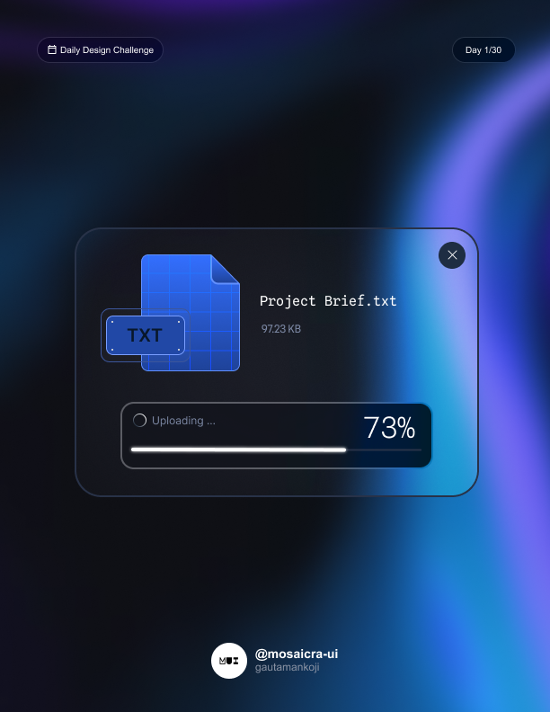                                                | [Download Figma File](./day01/00-files-uploader/files-uploader.fig) |
| **02**  | **Crypto Wallet**                  | 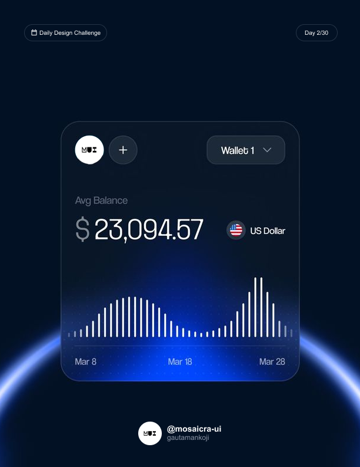                                             | [(NOT UPLOADED)](./day02/)                                          |
| **03**  | **Contact Page**                   | 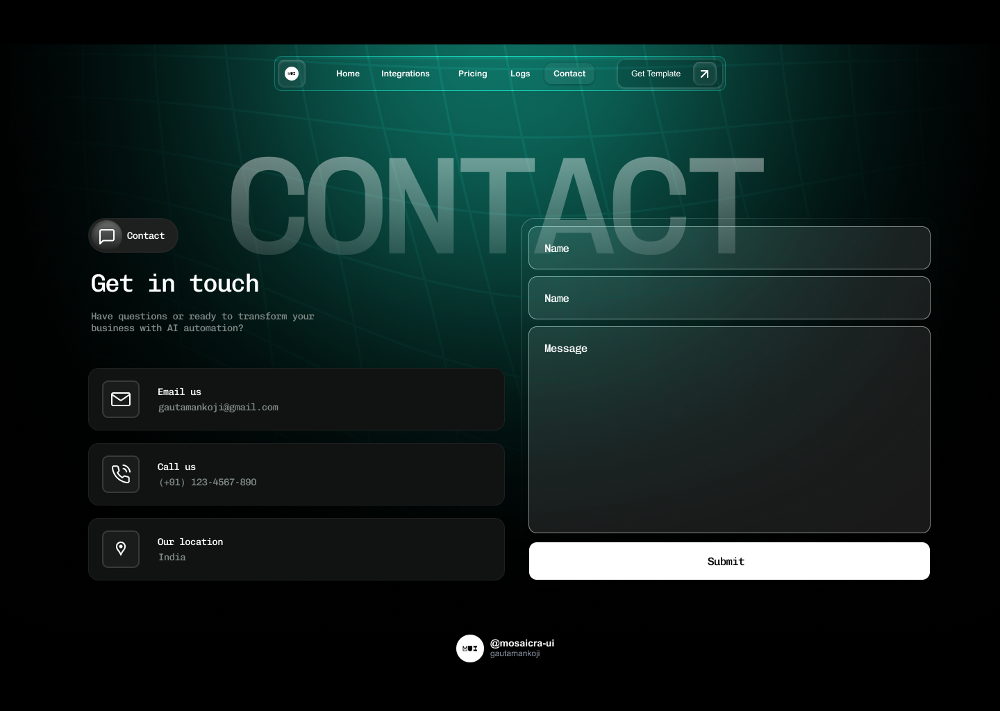                                                     | [Download Figma File](./day03/00-contact-page/contact-page.fig)     |
| **04**  | **Neubrutalism - Landing Page UI** | 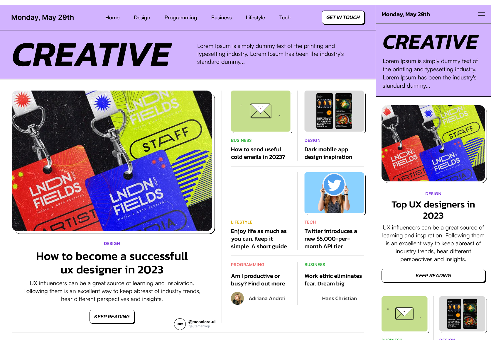          | [(NOT UPLOADED)](./day04--10-10-2024/)                              |
| **05**  | **FigChallenge - Landing Page**    | 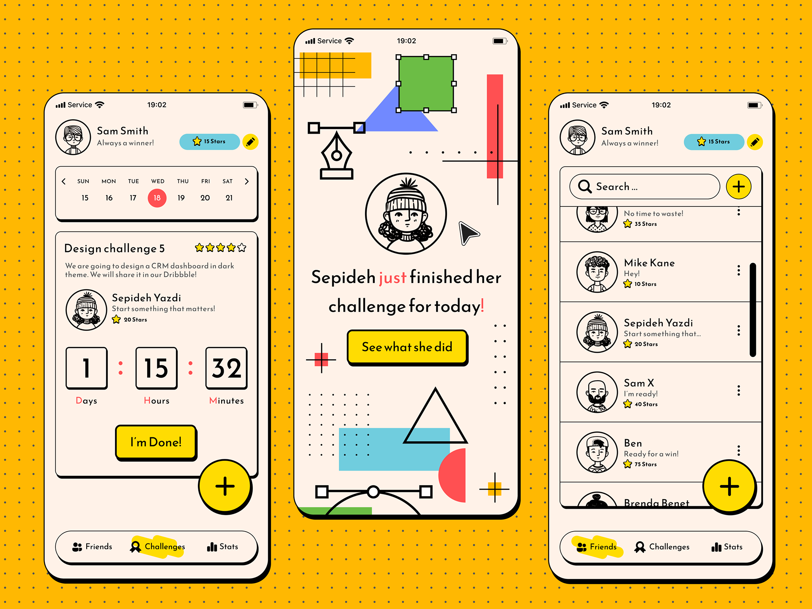                                              | [(NOT UPLOADED)](./day05--11-10-2024/)                              |
| **06**  | **Social Media Ads**               | 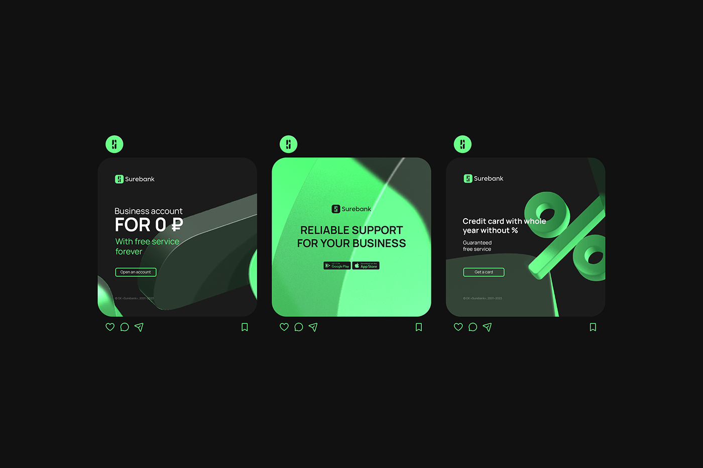                                                                  | [(NOT UPLOADED)](./day06--12-10-2024/)                              |
| **07**  | **Public API Landing Page**        | 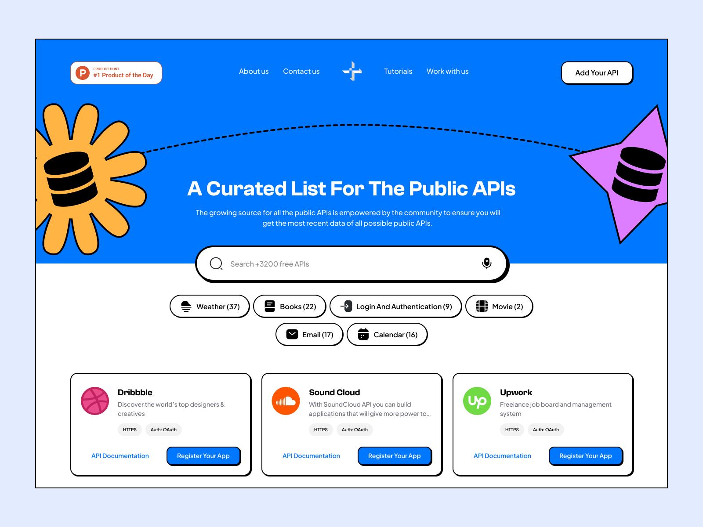                                                    | [(NOT UPLOADED)](./day07--13-10-2024/)                              |
| **08**  | **Glowing Purple Cards**           | 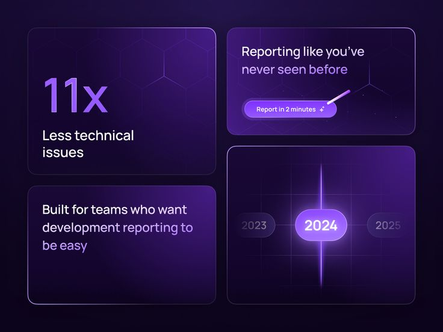                                                          | [(NOT UPLOADED)](./day08--14-10-2024/)                              |
| **09**  | **Brand Identity Card**            | 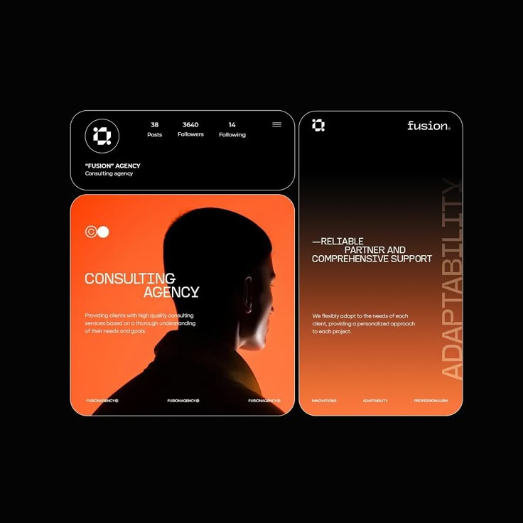                                                            | [(NOT UPLOADED)](./day09--15-10-2024/)                              |
| **10**  | **MC Stars Landing Page**          | 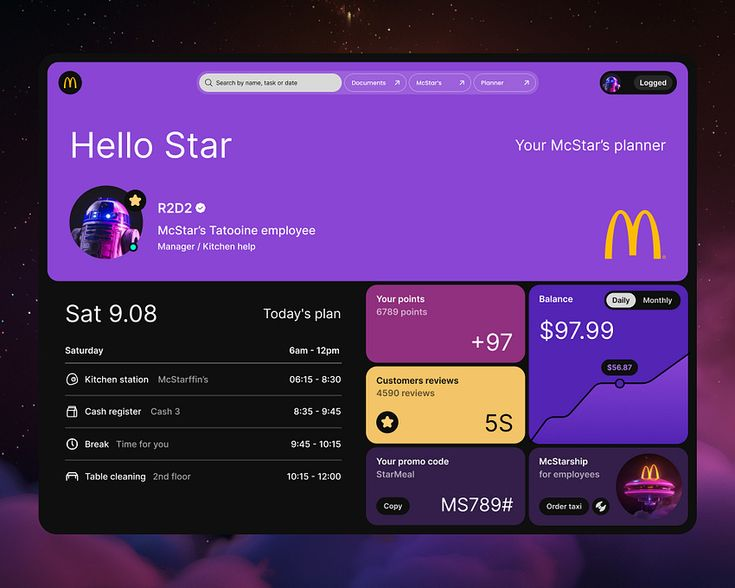 | [(NOT UPLOADED)](./day10--16-10-2024/)                              |
| **11**  | **KREA-ai Pricing Page**           | 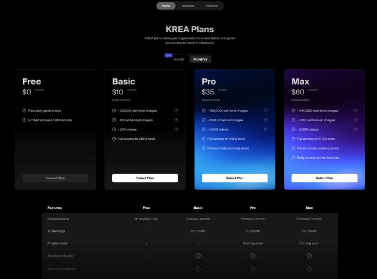                                                          | [(NOT UPLOADED)](./day11--17-10-2024/)                              |

## Participation Guidelines

1. **Create a Design**: Develop a design using Figma or code it based on the daily challenge prompt.
2. **Submit Your Work**: Upload your designs by forking the repository and submitting a pull request with your files.

### Submission Process

- **Fork the Repository**: [Mosaicra Design Challenge Repository](https://github.com/mosaicra-ui/mosaicra-design-challenge).
- **Clone the Repository**: Use Git to clone the repository to your local machine.
- **Create Your Folder**: Make a new folder with your name inside the corresponding day's folder (e.g., `day2/gautamankoji/`).
- **Upload Your Files**: Include your design files, images, and a README file with a sample image of your design.
- **Create a Pull Request**: Push your changes and submit a pull request (PR) for review.

### Submission Requirements

- Your submission must include a README file containing:
  - A sample image of your design.
  - Descriptions of any additional features or functionality you incorporated.
  
### Important Dates

- **Submission Deadline**: The last valid submission time is **23:00** every day. Ensure your submissions are made before this deadline.

### Judging Criteria

Prizes will be awarded at the end of the challenge! Judging will focus on:
- Consistency with the daily challenge prompt.
- Quality and aesthetics of design.
- Creativity and originality.

## Contact and Support

For any questions or assistance, please feel free to reach out through the issue tracker in the GitHub repository or contact the challenge organizers directly.

---

We look forward to seeing your innovative designs! Happy designing!
