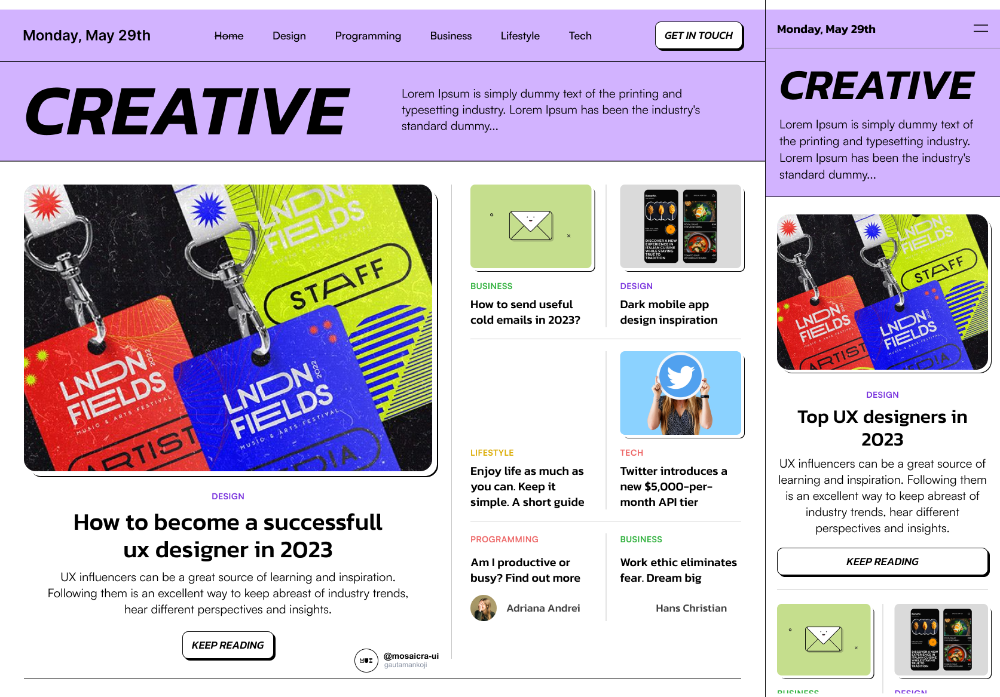
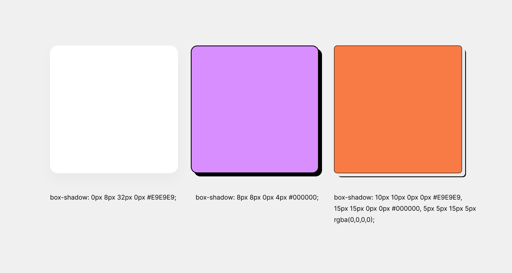
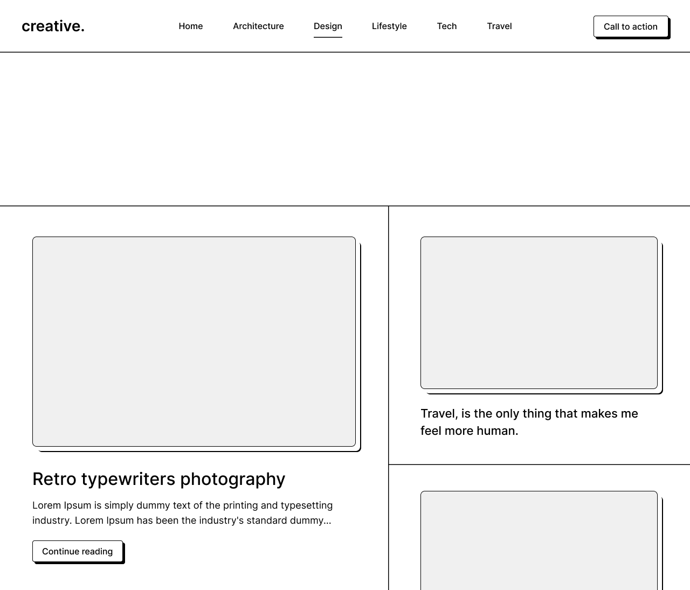
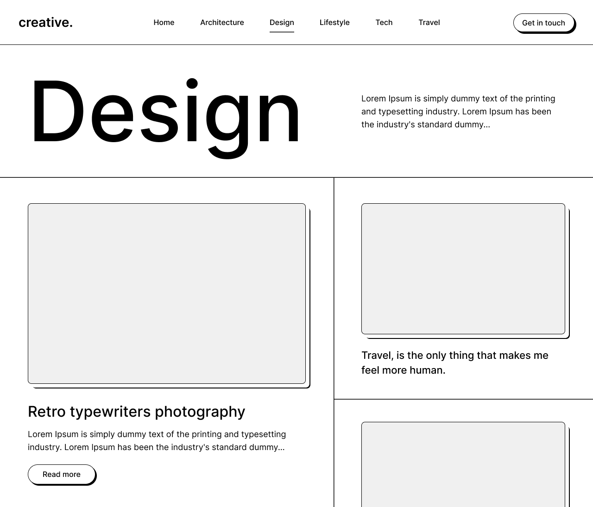
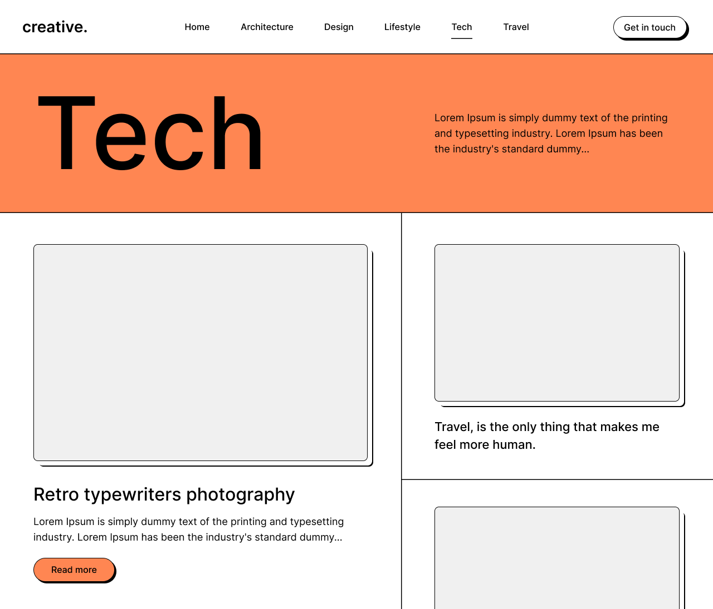
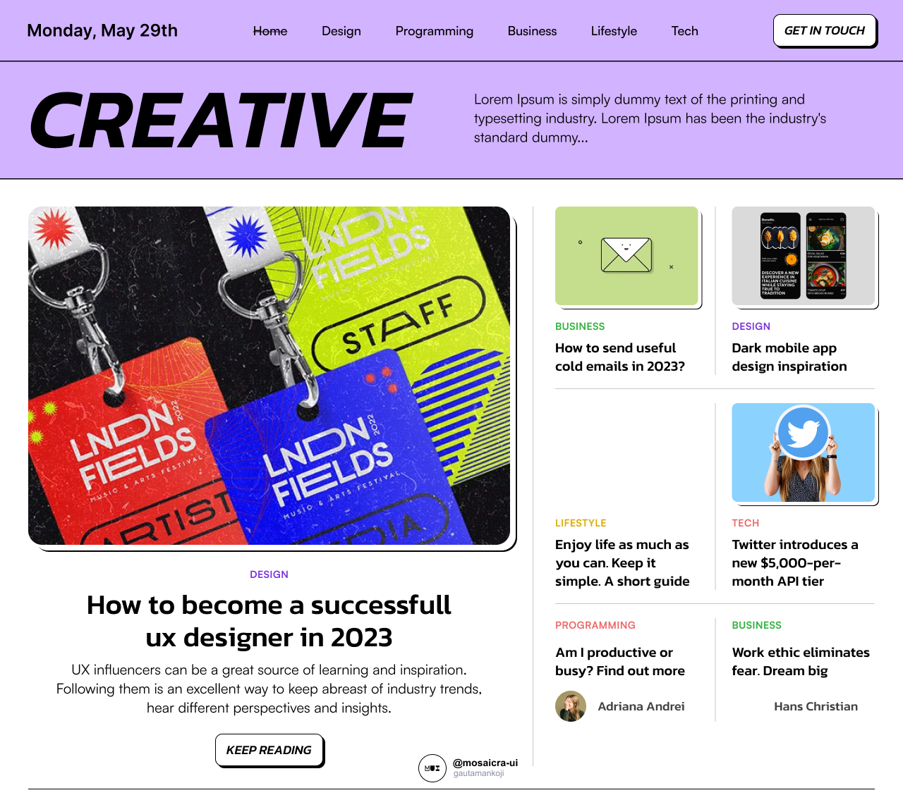

# Day 4: Neubrutalism - Landing Page UI

## What is Brutalism?

The term “Brutalism” comes from the French word “brut,” meaning “raw” or “uncultivated.” It originated in mid-20th-century architecture and became popular in the late 1950s and early 1960s.

## What is Neo-Brutalism in Design?

Neo-Brutalism in UI design mirrors the architectural style, characterized by bold, oversized typography, vibrant colors, strong contrasts, sharp edges, and solid background textures. This modern design trend aims to create a distinctive, creative output that enhances user experience.

## Is Minimalism the Same as Brutalism in UI Design?

Though minimalism and brutalism may appear similar, they are distinct in essence. Minimalist design involves using the fewest elements possible—simple colors, no extravagant patterns, and an uncluttered layout. It’s common for beauty websites, portfolios, or magazines.

In contrast, brutalist UI design uses bold, stand-out elements with bright, contrasting colors. It is a choice for those looking to express creativity and make an impact through design. Let’s explore the key elements of this style.

## Key Elements of Neubrutalism

### 1. Shadows

Unlike conventional soft shadows, Neo-Brutalist shadows are full-color, unblurred, and placed on both the x and y axes. These can be applied to buttons, cards, and decorative elements.

### 2. Separators

Whether thick or thin, separators help to organize the layout. Despite the use of various separators, the overall look remains cohesive and visually appealing.

### 3. Typography

Bold, large typography has a significant visual impact. It can be both functional and aesthetic, easily incorporated into your CSS.

### 4. Colors

While vivid, contrasting colors may raise concerns about readability or accessibility, they are central to Neo-Brutalism. Even with stark colors like pure black, it's okay as long as you perform proper usability tests.

### 5. Asymmetric Geometric Shapes

Challenging traditional design, asymmetric shapes like circles, triangles, rhombuses, and diamonds create a floating effect, adding dynamic visual interest to the layout.

## Resources

### Font Used

[Kanit](https://fonts.google.com/specimen/Kanit)

## Asset Images

|  |  |  |  |
| --------------------------------------------------------- | --------------------------------------------------------- | --------------------------------------------------------- | --------------------------------------------------------- |
